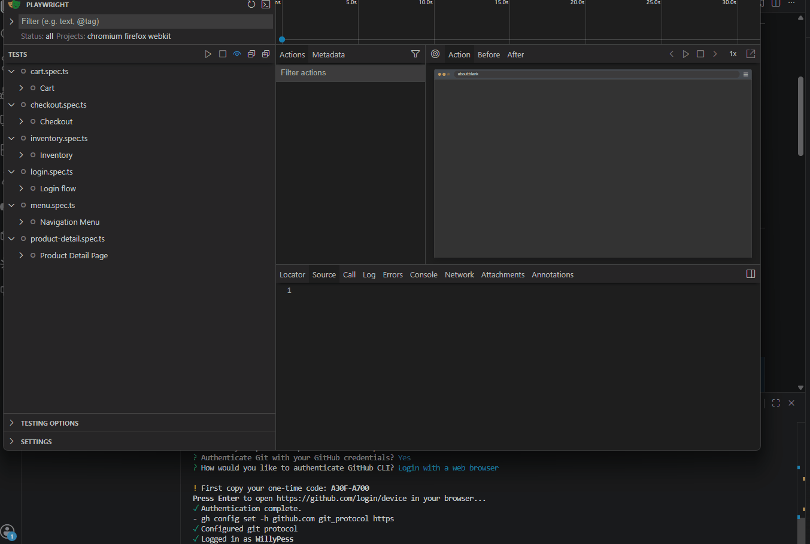
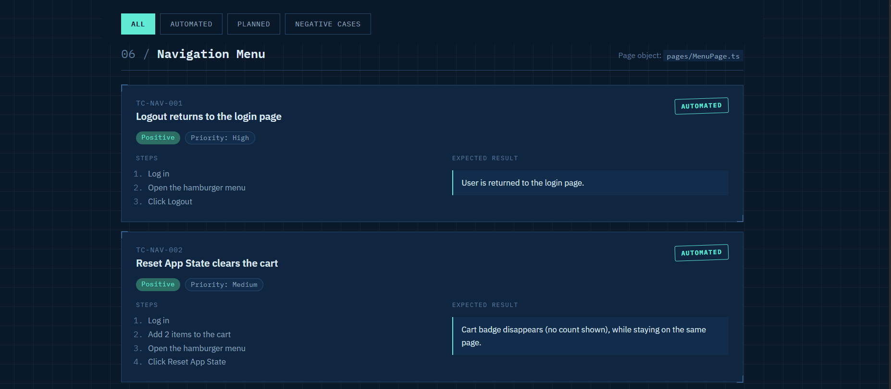
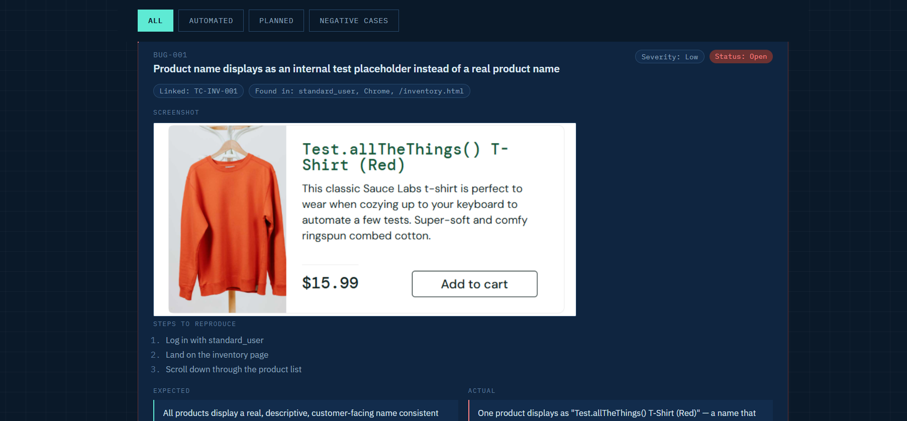

# Sauce Labs E2E Test Suite

Playwright + TypeScript end-to-end test suite covering the Sauce Labs checkout journey ([saucedemo.com](https://www.saucedemo.com)).

[](https://github.com/WillyPess/saucedemo-playwright-e2e/actions/workflows/playwright.yml)


<!-- TODO: record a short GIF showing `npx playwright test --ui` or a full run, save it to docs/demo.gif -->

## What this demonstrates

- **Page Object Model** — each page of the app is encapsulated in its own class: `LoginPage`, `InventoryPage`, `CartPage`, `CheckoutPage`, `CheckoutStep2Page`, `MenuPage`, `ProductDetailPage` ([pages/](pages/))
- **Centralized test data** — usernames/passwords and expected UI copy live in [tests/data/users.ts](tests/data/users.ts) and [tests/data/messages.ts](tests/data/messages.ts), not hardcoded in specs
- **Cross-browser coverage** — Chromium, Firefox, and WebKit locally; Chromium via `ubuntu-latest` in CI
- **Multiple reporters** — list, HTML, and JUnit output for both local runs and CI consumption

## Test Coverage

25 test cases across 7 feature areas: Login, Inventory, Cart, Checkout, Special Users, Navigation Menu, and Product Detail Page.

- 22 automated
- 3 planned (not yet implemented)

The full breakdown, including test IDs and status, is tracked as a living document in [test-plan/index.html](test-plan/index.html).



## Bug Registry

The test plan also includes a live Bug Registry documenting real defects found while writing and running this suite (2 logged so far). See [test-plan/index.html#bug-registry](test-plan/index.html#bug-registry) for details.



## Install and run

```bash
# install dependencies
npm install

# install browser binaries
npx playwright install

# run the full suite (Chromium, Firefox, WebKit)
npx playwright test

# run interactively with the Playwright UI
npx playwright test --ui

# view the last HTML report
npx playwright show-report
```

## Project structure

```
pages/          Page Object Model classes (LoginPage, InventoryPage, CartPage, ...)
tests/
  e2e/          Spec files (login, inventory, cart, checkout, menu, product-detail)
  data/         Centralized test data (users, messages)
test-plan/      Living test plan and bug registry (index.html)
docs/           Demo GIF and screenshots referenced by this README
```
